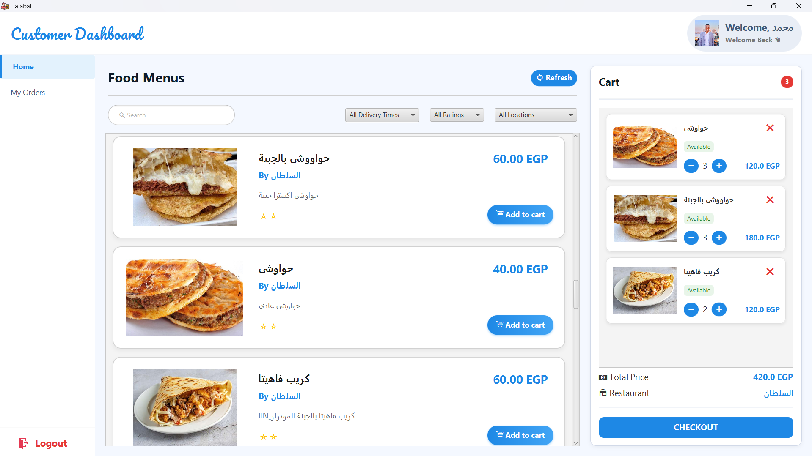
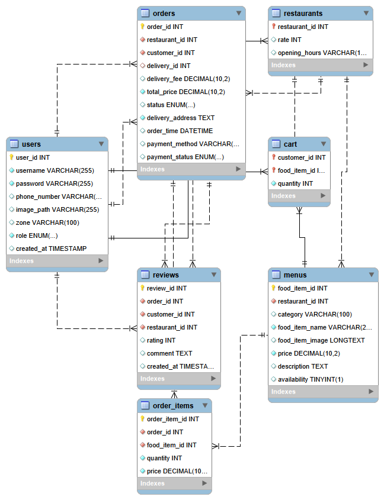

<h1 align="center">
    Food Ordering System
</h1>

<p align="center">
  
  
  
  
  
  
</p>

---

**Food Ordering System** is a full-featured JavaFX desktop application that simulates a real-world food delivery platform (similar to Talabat).  
The system supports multiple user roles and demonstrates strong software engineering principles with clean, maintainable, and scalable architecture.

---

## Demo Video

<p align="center">
  <a href="https://drive.google.com/file/d/1dtM4RGloMaTy0qhR7l0zP6pMNuqTpcAB/view">
    
  </a>
</p>

---

## Database Design

<p align="center">
  
</p>

- MySQL database: `food_ordering_system`  
- Core tables: Users, Orders, OrderItems, Restaurants, MenuItems, Reviews, Deliveries  

---


## Key Features

### 1. Multi-User Role System
- Customers: Browse restaurants, order food, track deliveries, manage cart, reviews & ratings  
- Restaurants: Manage menus, view and process orders  
- Delivery Personnel: Handle delivery assignments and update status  
- Secure authentication with role-based access and encrypted passwords  

### 2. Order Management
- Full order lifecycle tracking  
  *(Placed → Confirmed → Preparing → Out for Delivery → Delivered)*  
- Shopping cart system  
- Order history and tracking  

### 3. Payment System
- Multiple payment methods: Credit Card, Wallet, Cash on Delivery  
- Factory Pattern for payment handling  
- Adapter Pattern for unified payment interface  
- **Note:** Payments are **simulated (mock implementation)** for demonstration purposes (no real payment gateway integration)

### 4. Delivery Management
- Real-time delivery tracking  
- Distance-based delivery calculation  
- 32 Cairo zones with predefined distance matrix  
- Delivery time estimation and route optimization  

### 5. Restaurant & Menu Management
- Dynamic menu system with categories  
- Composite Pattern for hierarchical menus  
- Menu items with images, descriptions, and pricing  

### 6. User Experience
- Modern JavaFX UI using FXML  
- Styled with BootstrapFX  
- Form validation and input handling  
- Responsive layouts  

---

## Design Patterns Used

- **Facade Pattern** → Layered architecture & separation of concerns  
- **Factory Pattern** → User role & payment handling  
- **Strategy Pattern** → Role-based navigation  
- **Adapter Pattern** → Payment abstraction  
- **Composite Pattern** → Menu hierarchy  
- **State Pattern** → Order lifecycle  
- **Proxy Pattern** → Cart validation  
- **Flyweight Pattern** → View caching & performance  
- **Singleton Pattern** → Database connection  

---

## Tech Stack

- Java 25  
- JavaFX 21.0.6  
- JDBC  
- MySQL 8.0  
- Maven  

---

## Architecture

- MVC Architecture  
- N-Tier layered structure  
- Repository Pattern  
- Clean separation of concerns  
- Scalable & maintainable design  

---

## Project Structure

```
com.pattern.food_ordering_system/
├── config/
├── controller/
├── entity/
├── service/
├── repository/
├── model/
├── validatorMW/
└── utils/
```

---

## Contributors

- Amr Muhammed  
- Mohammad Metwally  

---

## Notes

- Developed as part of a **Design Patterns course**  
- Focused on applying **SOLID principles**  
- Emphasis on **clean architecture & scalability**
